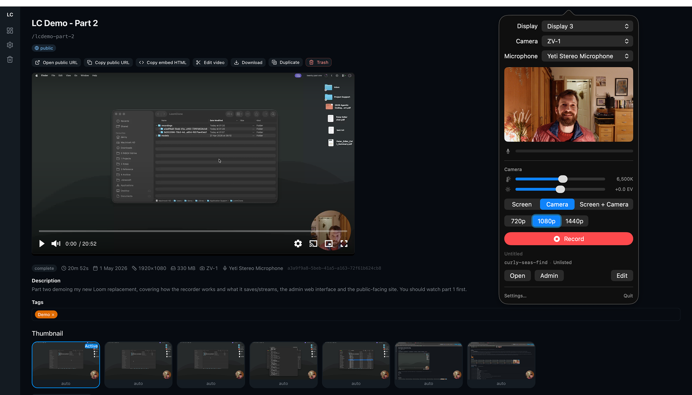
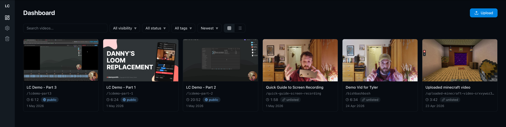

# LoomClone

> [!NOTE]
> This is a personal tool built for an audience of one. It's not packaged for others to deploy or use — this repo exists as a reference and because I like building in the open.
>
> Source is published under the [PolyForm Strict License 1.0.0](LICENSE.md) — read it, learn from it, but don't fork or run it as your own. I may relicense under something more permissive later; for now, all rights reserved.

A personal Loom replacement. A native macOS menubar app for recording, a server for processing and hosting, and a CDN-backed delivery layer — all on a domain I own.

[Loom](https://www.loom.com) works, but I don't own my URLs, can't switch between camera and screen mid-recording, the interface is cluttered with features I don't use, and Atlassian keeps adding AI things I didn't ask for. [Cap](https://cap.so) is open-source and lets me use my own domain, but it feels half-baked — things break randomly and it's not something I'd bet a permanent video library on.

So I built my own. One person records videos; other people watch them via URLs on `v.danny.is`. No team features, no social features, no viewer accounts. Just a tool that does one thing really well.

It has four parts:

1. **macOS App** — Native Swift/SwiftUI menubar app. Records screen, camera and mic; composites and streams to the server in real time.
2. **Server** — [Hono](https://hono.dev) + [Bun](https://bun.sh) on a Hetzner VPS. Receives streamed segments during recording, runs post-processing, stores everything.
3. **Admin Panel** — Web interface for managing videos. Dashboard, search, tagging, a lightweight video editor, upload for existing MP4s.
4. **Viewer Surface** — Public-facing video pages, embeds, feeds and metadata endpoints. Served through [BunnyCDN](https://bunny.net).




## Features

### Recording

The recorder is a macOS menubar app. Select a screen, camera and microphone, check the live preview, and hit record.

- Menubar app allows selection of screen, camera and microphone sources and shows previews & audio meter so you know everything's working ok before hitting record. The camera white balance and brightness can be tweaked before recording.
- Three recording modes — screen and camera, screen only, camera only — with instant switching mid-recording. The composited output cuts between modes instantly and (unlike Loom) uses the full-quality video feed when in camera-only mode.
- Draggable camera overlay that can be repositioned between corners during recording. Neither the overlay nor the recording toolbar appear in the captured screen-recording so we always get clean footage.
- Stream quality options: 720p, 1080p or 1440p.
- Optional toggles to hide desktop icons or hide windows from a chosen app in the screen recording. Lets you keep presenter notes open in something like Drafts or TextEdit — visible to you, invisible to viewers.
- Instant pause and resume so it's easy to quickly hot pause, change what's on the screen (or look at some notes) and then start recording again. Reduces the need for editing later on.
- The recording toolbar and camera overlay float above fullscreen apps and follow you across macOS Spaces. This makes it easy to set up each thing you want to show as its own fullscreen Space — slides, a demo app, a terminal — and just swipe between them while recording.
- The moment you hit stop, a shareable URL is on your clipboard. Segments were streaming to the server throughout recording, so viewers can watch immediately — before post-processing has even started.
- Edit title, slug and visibility directly in the menubar app after recording, without opening a browser.

### Resilience

A core principle of this project is "never lose footage." Recording a 20-minute tutorial and losing it to an upload glitch or encoding failure is mega frustrating so the system is designed with redundancy and recovery at every level.

- Raw streams saved locally as `screen.mov`, `camera.mp4` and `audio.m4a` at full quality, independent of what gets streamed to the server. Even if everything else fails, the raw footage is always on disk for recovery or editing in Final Cut Pro.
- Tolerant of network loss during recording. Segments queue locally and upload when the connection returns — even a 10-minute outage just means a delayed upload, not lost video.
- Self-healing after every recording. The HLS segments are saved locally before being sent to the server. After every recording the server and client compare segment inventories and automatically resend anything missing. This also runs on app launch for any recordings from the last few days, just in case.
- All uploads are idempotent — re-sending a segment or sending them out of order always converges to the correct result. The server rebuilds its playlist from what's on disk, not from request arrival order.
- Server data is backed up daily to separate encrypted storage.

### Post-Processing

Once recording is complete, the server runs a series of background jobs automatically. None of them block the shareable URL from working.

- **Audio enhancement** — high-pass filter, RNN-based noise removal and two-pass loudness normalisation. Background hum, fan noise and uneven levels are cleaned up automatically.
- **Thumbnail selection** — multiple candidate frames extracted and scored by visual quality. The best one becomes the poster image, with the option to pick a different candidate or upload a custom thumbnail in the admin panel.
- **Video variants** — downsampled 720p and 1080p versions generated automatically from the source.
- **Storyboard** — for videos over 60 seconds, a sprite sheet is generated so the player shows frame previews when scrubbing the timeline.
- **Transcription** — runs on-device via [WhisperKit](https://github.com/argmaxinc/WhisperKit) on the Mac, so there are no external API costs and nothing leaves the machine. The transcript powers subtitles in the player, full-text search in the admin panel, and machine-readable metadata on the public site. Suggested title and description are also generated from the transcript using Apple's on-device foundation models.

### Admin Interface

A web-based admin panel for managing videos — similar in spirit to Loom's library, but built for one person.

- Dashboard with grid and table views, full-text search across titles, descriptions, slugs and transcripts, filters for visibility/status/tags/date/duration, and sort options.
- Three visibility states: **unlisted** (shareable by URL, not indexed by search engines — the default), **public** (appears in feeds and sitemap), and **private** (visible only in the admin panel).
- In-place editing of title, slug, description, visibility and tags, plus an admin-only private notes field for context, ideas or follow-ups.
- Web-based video editor for trimming and cutting out sections with waveform visualisation, plus auto-detected silent sections offered as one-click suggested cuts. Edits are non-destructive since the original source is always preserved.
- Upload existing MP4s — Loom exports, YouTube downloads etc. They run through the same post-processing pipeline as recorded videos.
- Activity log tracking every meaningful change to a video and a file browser for each video's server-side directory — useful for debugging without having to SSH in.
- Lots of small quality-of-life touches: when editing a slug there are buttons to generate from title, prepend today's date or append a random string. Thumbnail picker with auto-generated candidates. Video duplication. Soft-delete trash bin.

### Viewer Experience

When someone clicks a video link, it should just work — load fast, play smoothly, look good on any device.

- [Vidstack](https://www.vidstack.io)-based player with poster image, subtitles from the generated transcript, and storyboard hover previews when scrubbing longer videos.
- Served through BunnyCDN with appropriate cache headers. The origin server handles processing; the CDN handles delivery.
- Chromeless embed player at `/:slug/embed` for iframes, with a pre-play overlay showing title, duration and a play button.
- Full SEO metadata: Open Graph video tags, Twitter Card player embeds, JSON-LD, canonical URLs. Unlisted videos get `noindex`; public ones appear in the sitemap.

### Feeds, Formats & Permanent URLs

Beyond the video page itself, every public video is accessible through multiple channels designed for different consumers.

- Every video available as structured JSON (`/:slug.json`), Markdown (`/:slug.md`) and raw MP4 (`/:slug.mp4`).
- [oEmbed](https://oembed.com) endpoint for automatic rich previews in Notion, Slack, WordPress and anything else that supports oEmbed discovery.
- RSS feed (`/feed.xml`) and [JSON Feed](https://www.jsonfeed.org) (`/feed.json`) for public videos, with media enclosures, thumbnails and truncated transcripts.
- [`llms.txt`](https://llmstxt.org) dynamically generated with endpoint documentation and a list of public videos — built for AI agents and programmatic consumers.
- Permanent URLs: changing a video's slug automatically creates a 301 redirect from the old URL. Links shared in Notion pages, Google Docs and knowledge bases years ago will still work.

## Development

Prerequisites: [Bun](https://bun.sh), [ffmpeg](https://ffmpeg.org), Xcode 16+.

**Server:**

```sh
cd server
bun install
bun run dev
```

This starts a hot-reloading dev server on `http://localhost:3000`.

**macOS app:**

Open `app/LoomClone.xcodeproj` in Xcode and run the `LoomClone` scheme. The Xcode project is generated from `app/project.yml` via [XcodeGen](https://github.com/yonaskolb/XcodeGen) — run `cd app && xcodegen generate` after adding or removing Swift files.

## Contributing

This is a personal project and I'm not looking for contributions at the moment. That said, issues are welcome if you spot bugs or have questions.

## License

[PolyForm Strict 1.0.0](LICENSE.md). Source-available, not open source — read freely, but don't fork, modify, or run it. Future relicensing under a permissive license is possible but not promised.
